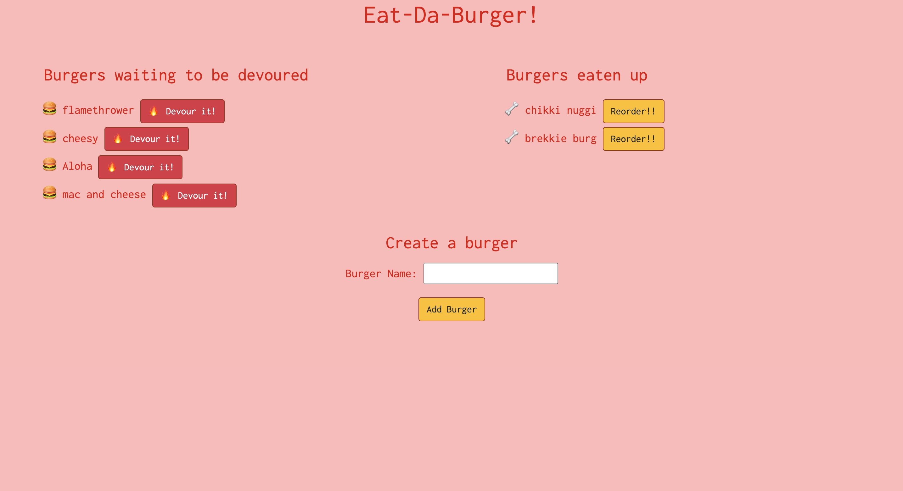

# Node-Express-Handlebars: Eat-Da-Burger
[](https://opensource.org/licenses/MIT)

## Table of Contents
- [Description](#description)
- [Installation](#installation)
- [Usage](#usage)
- [License](#license)
- [Contributing](#contributing)

## Description
A burger logger using Node, Express, Handlebars, MySQL, and an ORM to track what burgers are ready to be eaten, and which ones have already been devoured.

## Installation
Clone or download the package and open terminal in the package directory. Then run the following command to install all the dependencies into the local node_modules folder:

```
npm i
```

## Usage
The deployed application is [here](https://damp-lowlands-67480.herokuapp.com/).

The application will look something like this:


## License
Licensed under the MIT License.

## Contributing
To contribute directly to the code base, please see this [How to Contribute](https://github.com/Microsoft/vscode/wiki/How-to-Contribute) document.
